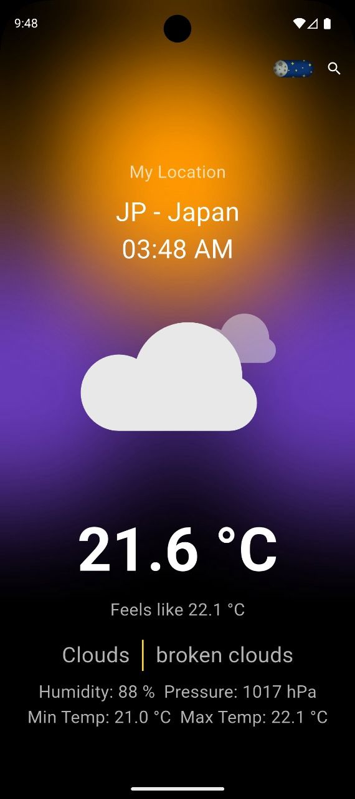
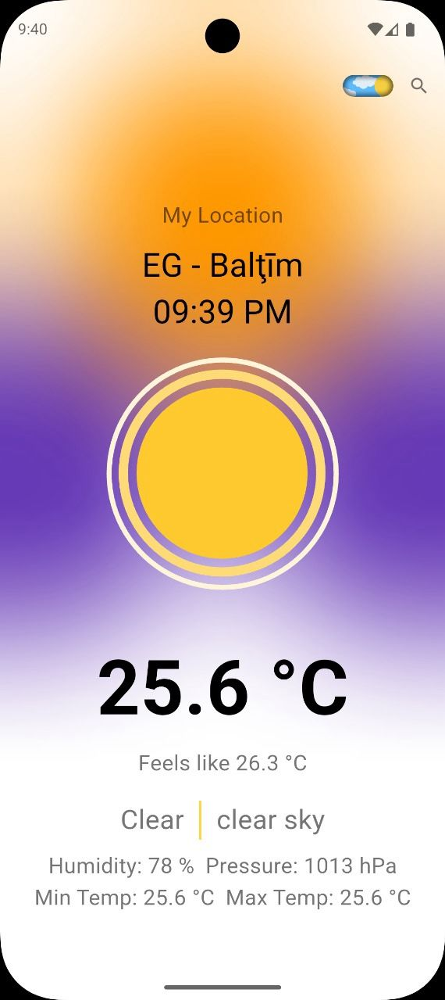
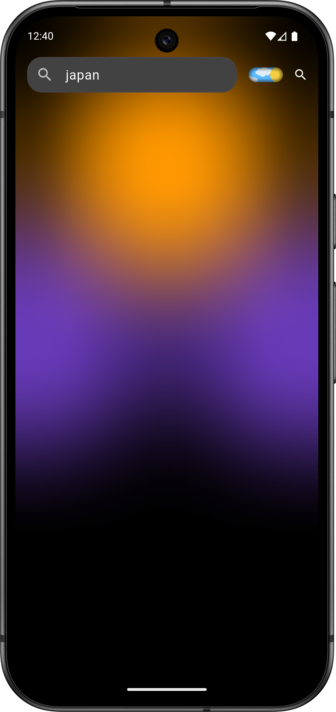
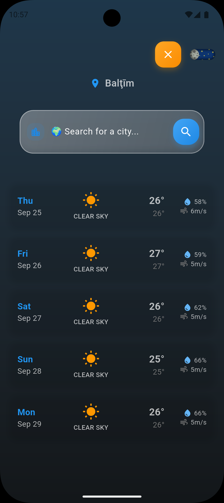
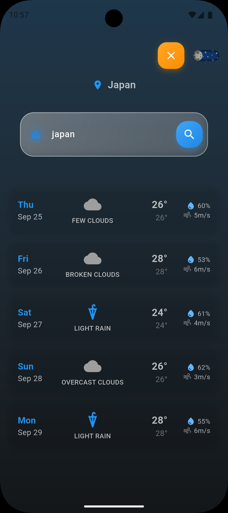
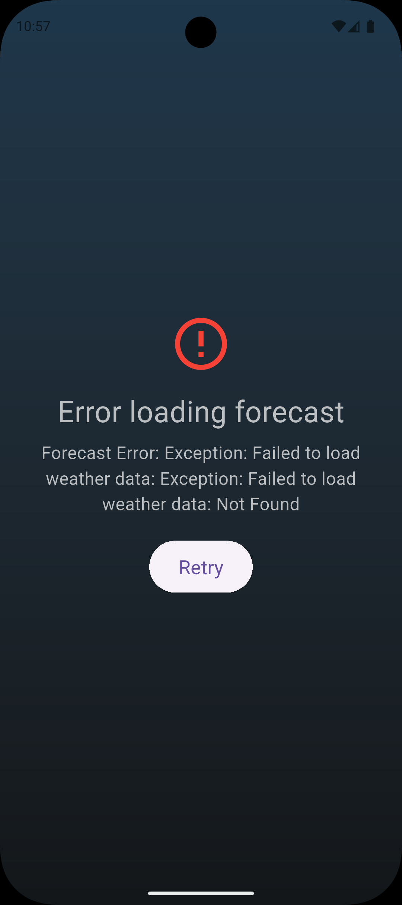

# Weather App 🌤️

A Flutter practice project focused on mastering **Cubit state management** and **API integration**.

## 🎯 Purpose

Built to practice and learn:

- **Cubit/Bloc State Management** - Reactive UI with proper state transitions
- **REST API Integration** - Weather data with error handling
- **Location Services** - GPS integration
- **Theme Management** - Dark/Light mode with persistence
- **Clean Architecture** - Separation of concerns

## 📱 Features

- Real-time weather data from OpenWeatherMap API
- get weather forecast for 4 days
- Location-based weather fetching
- City search functionality
- Dark/Light theme toggle with persistence
- Pull-to-refresh and error handling

## screenshots

<table>
    <tr>
        <td></td>
        <td></td>
        <td></td>  
    </tr>
    <tr> 
    <td></td>
        <td></td>
        <td></td>     
    </tr>
</table>

## 🛠️ Tech Stack

- **Flutter** - Cross-platform framework
- **Cubit** - State management
- **HTTP** - API integration
- **Geolocator** - Location services
- **SharedPreferences** - Local storage
- **Lottie** - Animations

## 📚 Skills Demonstrated

✅ Flutter development with modern practices  
✅ State management using Cubit pattern  
✅ API integration with error handling  
✅ Location services and permissions  
✅ Persistent storage and theming  

---

_Practice project for Flutter & Cubit mastery_ 🚀
